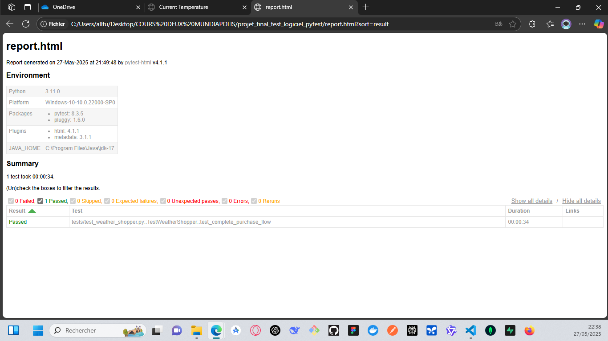

# Projet d'Automatisation des Tests pour Weather Shopper

Ce projet contient des tests automatisés pour le site de démonstration "Weather Shopper", une boutique en ligne qui vend des produits de soin en fonction de la température ambiante. L'objectif principal est d'automatiser un parcours utilisateur complet ("happy path").

**Site Testé :** [https://weathershopper.pythonanywhere.com](https://weathershopper.pythonanywhere.com)

## Fonctionnalités Testées

Le scénario principal automatisé couvre les étapes suivantes :

1.  **Lecture de la Température :** Récupération de la température affichée sur la page d'accueil.
2.  **Navigation Conditionnelle :**
    - Redirection vers la page "Moisturizers" si la température est < 19°C.
    - Redirection vers la page "Sunscreens" si la température est > 34°C.
    - (Le test est ignoré si la température est entre ces deux valeurs).
3.  **Sélection de Produits :**
    - **Moisturizers :** Ajout au panier du produit le moins cher contenant "Aloe" ET du produit le moins cher contenant "Almond".
    - **Sunscreens :** Ajout au panier du produit le moins cher contenant "SPF-30" ET du produit le moins cher contenant "SPF-50".
4.  **Vérification du Panier :**
    - Confirmation que deux articles sont présents.
    - Vérification que le montant total correspond à la somme des prix des articles sélectionnés.
5.  **Simulation de Paiement :**
    - Clic sur "Pay with Card".
    - Remplissage du formulaire de paiement Stripe avec des identifiants de test.
    - Validation de l'affichage du message "Payment successful".

## Technologies Utilisées

- **Langage :** Python 3
- **Framework de Test :** Pytest
- **Automatisation Web :** Selenium WebDriver (avec ChromeDriver)
- **Gestion des Pilotes de Navigateur :** Webdriver Manager
- **Design Pattern :** Page Object Model (POM) pour une meilleure organisation et maintenabilité du code.

## Structure du Projet

Le projet est organisé selon le pattern Page Object Model :

- `pages/` : Contient les classes représentant les différentes pages de l'application (HomePage, ProductPage, CartPage, PaymentPage) et une `BasePage` pour les fonctionnalités communes.
- `tests/` :
  - `conftest.py` : Définit les fixtures Pytest (notamment la configuration du WebDriver).
  - `test_weather_shopper.py` : Contient le cas de test principal qui exécute le scénario utilisateur.

Vous trouverez ci-dessous un exemple du rapport HTML généré après l'exécution des tests :



## Prérequis

- Python 3.x installé.
- Navigateur Google Chrome installé.

## Installation des Dépendances

1.  Clonez ce dépôt :
    ```bash
    git clone https://github.com/01warrior/Automatisation-des-tests-fonctionnels-Web-Weather-Shopper
    ```
2.  Créez et activez un environnement virtuel :
    ```bash
    python -m venv venv
    # Sur Windows
    venv\Scripts\activate
    # Sur macOS/Linux
    source venv/bin/activate
    ```

3.  Installez les dépendances listées dans `requirements.txt` :
    ```bash
    pip install -r requirements.txt
    ```

## Exécution des Tests

Pour exécuter les tests, naviguez à la racine du projet dans votre terminal et lancez la commande Pytest :

```bash
pytest
```
